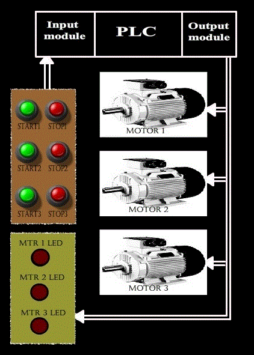
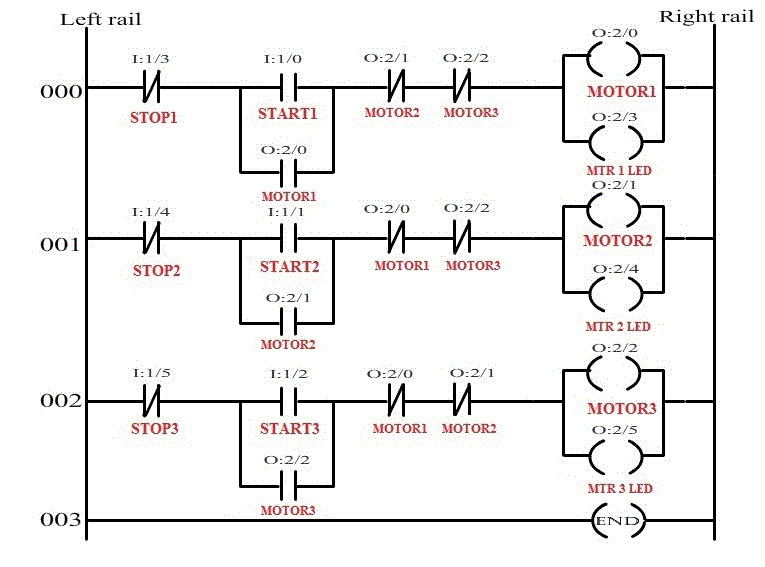
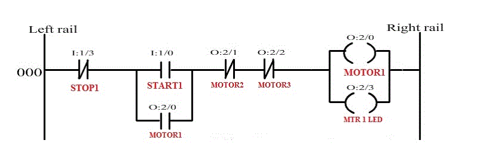
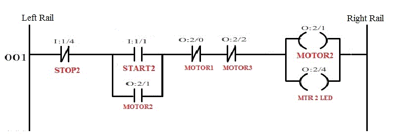
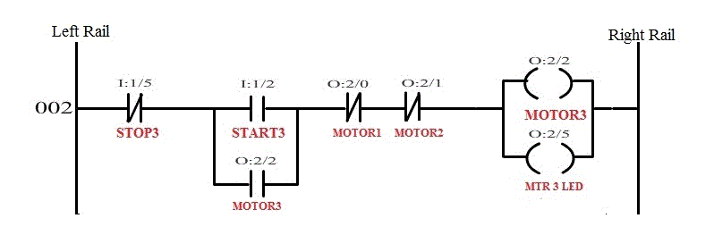
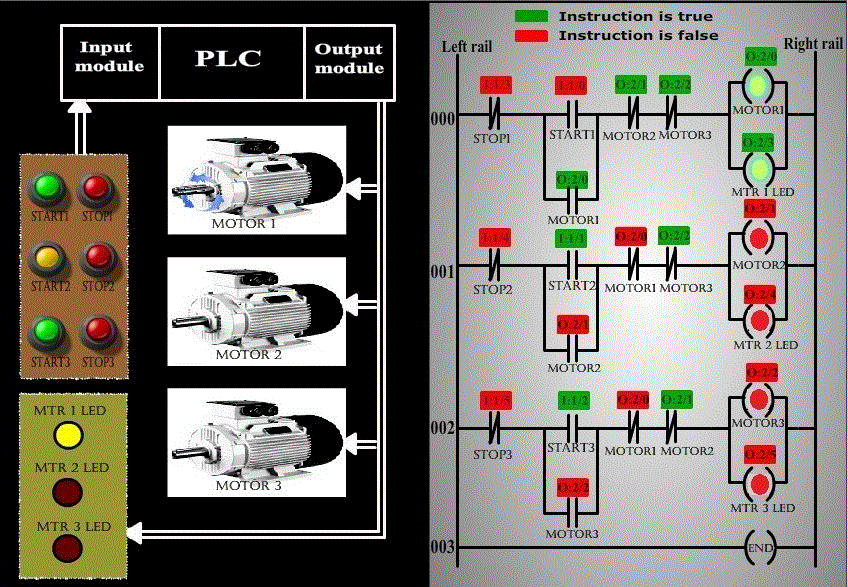

### Procedure :

In our experiment, there are 3 motors which can be turned ON  or OFF via PLC. But we wish to have a simultaneous output interlock. That is, only one motor can be running at a time. If the operator wants to start another motor, then he has to stop the motor which is currently running. Then only he can turn on another motor.
 
 Let us see the basic diagram of the circuitry.

 
 

#### Ladder Logic design :

Now, let us see how the ladder logic of simultaneous output interlock of 3 motor is implemented using PLC.

##### Our assumption:
<ul type=disc style="text-align: justify;">
<li>All the three motors have their own START and STOP push buttons. Both START and STOP push buttons are of normally open types.</li> 

<li>Since inputs and outputs are less, 8-point I/O module is sufficient, where CPU resides in slot 0, input module resides in slot 1 and output module resides in slot 2.</li> 
<li>Let us assign address for the input and output signals of the PLC.  

<ul type=square>
<li>START1(Normally open push button) = I : 1/0</li> 
<li>START2(Normally open push button) = I : 1/1</li> 
<li>START3(Normally open push button) = I : 1/2</li> 
<li>STOP1(Normally open push button) = I : 1/3</li> 
<li>STOP2(Normally open push button) = I : 1/4</li> 
<li>STOP3(Normally open push button) = I : 1/5</li> 
<li>MOTOR1 = O:2/0</li> 
<li>MOTOR2 = O:2/1</li> 
<li>MOTOR3 = O:2/2</li> 
<li>MTR 1  LED= O:2/3</li> 
<li>MTR 2  LED= O:2/4</li> 
<li>MTR 3  LED= O:2/5</li> 
</ul>
</li>

<li>Let us see its ladder logic 

 

 The above ladder program has 3 rungs, let us see the function of each rung individually.
</li>
</ul>

#### Rung 000:

The above rung is used to energize MOTOR1. In this rung, logical continuity is passed only when MOTOR2, MOTOR3 are in de-energized state. The logical continuity is lost whenever the STOP1 push button is pressed. If MOTOR2 and MOTOR3  are in de-energized is seen using MTR1LED, which is connected in parallel with MOTOR1.So if we want to energize MOTOR2 or MOTOR3, then MOTOR1 has to be stopped and then only MOTOR2 or MOTOR3 has to be started(only one can be started).

#### Rung 001 :

The above rung is used to energize MOTOR2. In this rung, logical continuity is passed only when MOTOR1, MOTOR3 are in de-energized state. The logical continuity is lost whenever the STOP2 push button is pressed. If MOTOR1 and MOTOR3  are in de-energized is seen using MTR2LED, which is connected in parallel with MOTOR2.So if we want to energize MOTOR1 or MOTOR3, then MOTOR2 has to be stopped and then only MOTOR1 or MOTOR3 has to be started(only one can be started).

#### Rung 002 :

The above rung is used to energize MOTOR3. In this rung, logical continuity is passed only when MOTOR2, MOTOR1 are in de-energized state. The logical continuity is lost whenever the STOP3 push button is pressed. If MOTOR2 and MOTOR1  are in de-energized is seen using MTR3LED, which is connected in parallel with MOTOR3.So if we want to energize MOTOR2 or MOTOR1, then MOTOR3 has to be stopped and then only MOTOR2 or MOTOR1 has to be started(only one can be started).

##### The following screen shot represents the operation :
 

 The above screen shot represents the condition where MOTOR1 is running, and on the pressing of START2 button does not energize MOTOR2, thus achieving Simultaneous output interlock using PLC.
